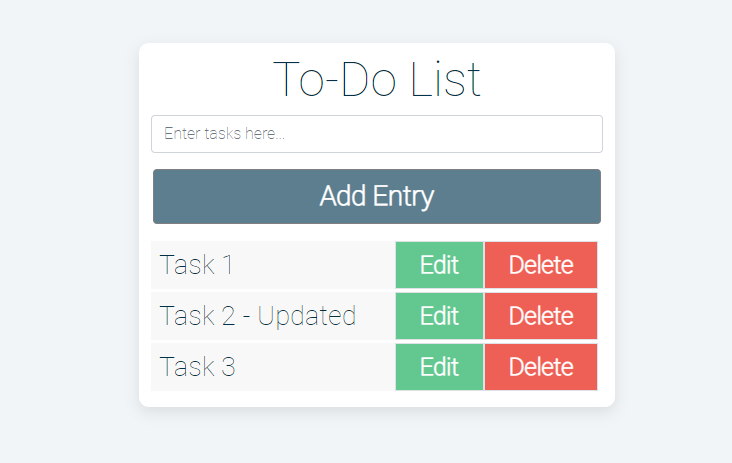

# To-Do List

A web-based application which allows users to add, remove, and update items on a to-do list. Built with JavaScript, Bootstrap, and CSS.

## Project Screen Shots

To-Do List Start Screen

To start, please enter a task in the input box and click "Add Entry".

List Item Added

The tasks will populate under the "Add Entry" button.

Update An Entry

To update an entry, please click on the "Edit" button. The text for that entry will convert into an input box. After you have typed in your update, please click the "Update" button.

Your Updates Will Remain In Order

The updated text will remain in the same location in the list of entries.

## Launch Instructions

Clone this repository to your local machine. 

In VS Code, right click on the index.html file and select "Open With Live Server". The application will launch in your web browser.

**Please note that this application requires an internet connection.  

## Reflection

This was one of my first JavaScript projects created without the use of a specific tutorial. One of the main challenges of this project was to understand data flow in JavaScript and alignment in Bootstrap/CSS.
